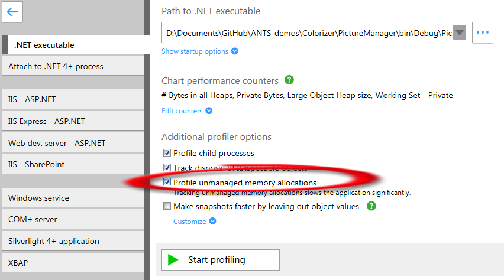
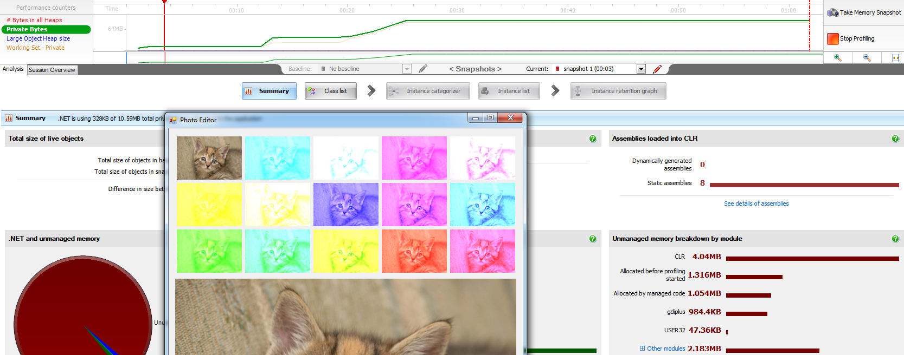
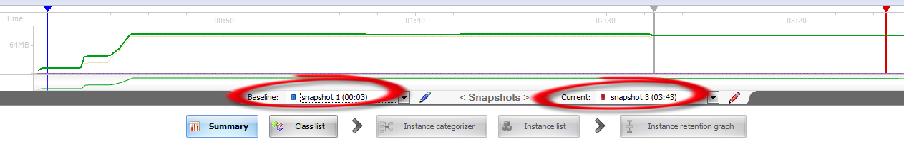
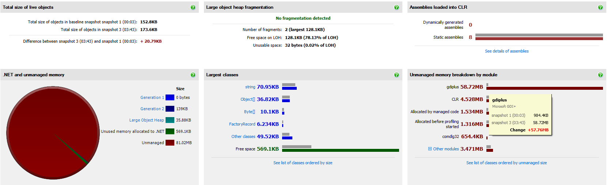
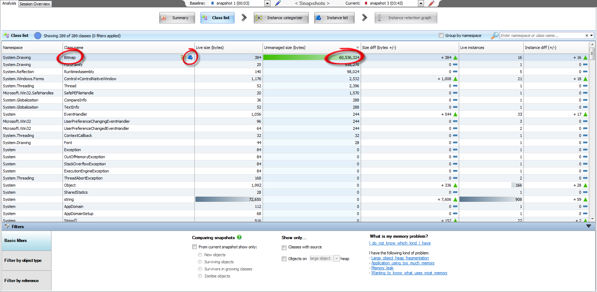
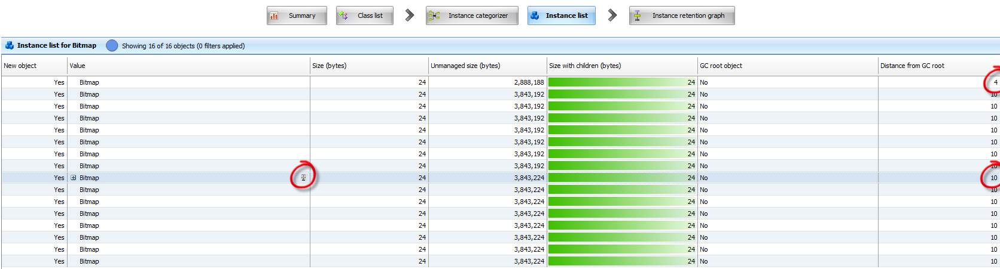
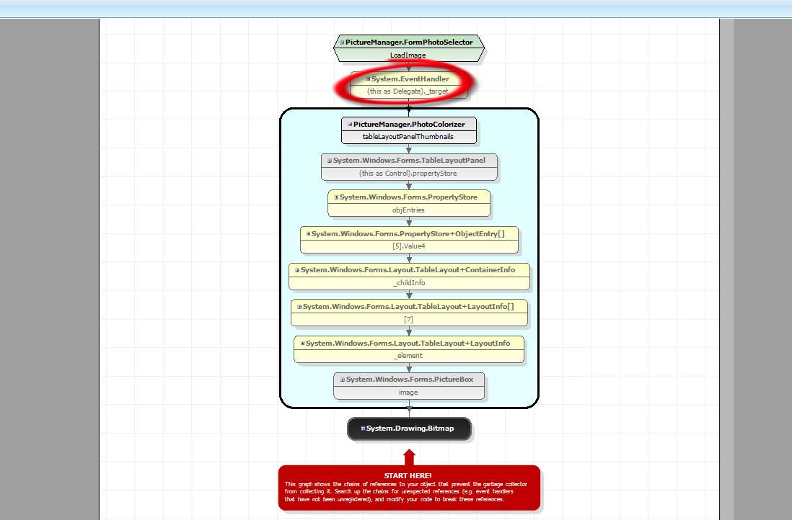

# Photo Colorizer

Ensure that the application has been rebuilt on the local machine at the location where it is currently being run from.

Start profiling the application, ensuring in particular that the **“Profile Unmanaged Memory”** option is selected.



Take a memory snapshot as a baseline. In the **PhotoSelector** window, click **Open New Image**, and browse to the picture of RedGate's `cake.jpg` which is provided alongside the project files. Wait for the coloured images to be shown, then point out that memory usage has gone up.

It’s useful to switch the timeline graph to look at the **Private Bytes** counter to illustrate this.



Next close the **PhotoEditor** window containing the images. At this point the **PhotoSelector** window should still be open. Point out to the developer that we would have expected memory usage to go back down, but for some reason it hasn’t.

To investigate why, we take 2 more memory snapshots. Use the snapshot selectors to compare the most recent snapshot to the first baseline snapshot we took when the application has just started.



The summary screen should show a large amount of unmanaged memory in the pie chart in the bottom left. Because of that, we look at the unmanaged memory module breakdown in the bottom right, which shows the gdiplus imaging libraries using a large amount of memory in the current snapshot (red) compared with the baseline snapshot (grey). At this point we’ve narrowed the issue down to something to do with imaging. To get more information about why gdiplus is using so much unmanaged memory, we can click **“See list of classes ordered by unmanaged size”**, to take us to the **class list**.



In the **class list** you can show the various filtering using the filters at the bottom of the screen, and sort the .NET classes by clicking on the column headings. Sort it by **“Unmanaged size (bytes)”** to see the `Bitmap` class at the top of the list. `Bitmap` is the .NET class which is using the unmanaged **gdiplus** module.



In the **class list** select the `Bitmap` class and click on the blue building block item to go to the **Instance List**, which shows the 16 instance of the `Bitmap` class in memory. Most will have the same Distance from GC Root (10), but one will be different. On one of the ones which are 10 away, click the graph icon to view that object’s **Instance Retention Graph**.



The **Instance Retention Graph** shows the references which hold the `Bitmap` objectin memory. Starting at the bottom with the `Bitmap` object, you can read up the chains of references, and see at the top that the **PhotoSelector** window is
responsible for holding the **PhotoColorizer** form in memory via an event handler.

The **PhotoColorizer** form then in turn holds the `Bitmap` classes in memory (via a `TableLayoutPanel`) even though the form has been closed. To solve the problem, we’d need to unregister the `LoadImage` event handler.



## Solution
The following changes to the **PhotoColorizer** class fix the memory leak:

1. Place to store a reference to the parent form, which we need to be able to access later in order to unregister the event handler
2. During the constructor for the `PhotoColorizer` class we store a reference to the parent window in the `ParentForm` variable so that we can access it later.
3. We create a new `FormClosed` method for the `PhotoColorizer` class and set that method up to run when the form gets closed. This method uses the reference we stored in the `ParentForm` variable to unregister the leaking event handler, which removes the reference and fixes the memory problem.

```cs
public partial class PhotoColorizer : Form
{
  private string fileName;
  private FormPhotoSelector ParentForm; // 1
  public PhotoColorizer(FormPhotoSelector parentWindow, string filePath)
  {
    ParentForm = parentWindow; // 2
    fileName = filePath;
    this.Show();
    parentWindow.LoadImage += newWindowLoaded;
    InitializeComponent();
  }

  private void PhotoColorizer_FormClosed(object sender, FormClosedEventArgs e)
  {
    ParentForm.LoadImage -= newWindowLoaded; // 3
  }
}
```

We could then re-profile the application with **ANTS Memory Profiler** to demonstrate that memory usage has indeed returned to normal. It’s worth noting that memory usage only drops back down when the garbage collector runs. This happens when ANTS takes a memory snapshot, or alternatively to force a **Garbage Collection**, you could call `GC.Collect()` in the `FormClosed()` method after unregistering the event handler.
