# Library Manager

## About

Library Manager is an admin console that could be used at a library. It’s build with WinForms / EF / SQL Server. It has a few performance problems, designed to help illustrate functionality in **ANTS Performance Profiler**. The database was built with **SQL Source Control**, with **SQL Data Generator** creating plausible test data.

LibraryManagerAsync is a reimplementation of LibraryManager using C#5 Async / Await, which can help understand ANTS Performance Profiler's support for this technology.

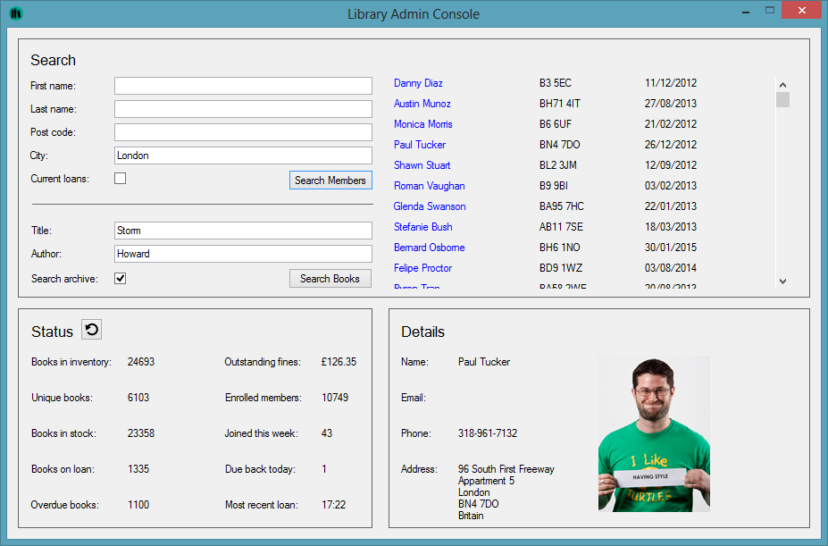

## Setup

### Database
Create a blank database and restore it from the backup file using `WITH_REPLACE`.

Alternatively you could create a blank database, link it to the `\Database\` folder using **SQL Source Control** to update the schema (or use **SQL Compare** by comparing from the scripts folder), then use **SQL Data Generator** to populate the data.

### API
Create a new website in IIS pointing to the website in the `\Api\` folder (app pool set to use **.NET 4**). This steps only needed to demo issue 3 (slow web request).

### Application
Open the app in VS, and modify `app.config`. Change the connection string to the database you’re created, and the `ApiBaseUrl` key to the website you created (leave the `/Api/V2` part of the url intact). Clean + rebuild the application, including fetching missing nuget packages (this is essential to create PDBs in the right place). Always profile the debug build of the application.

## Performance problems

### Application startup is a bit slow

ANTS shows a spike in CPU usage while the application loads. Selecting this spike in the timeline, ANTS shows a call tree like the one below. There are a few queries running, which are quite fast, but most time is being spent in methods without source.

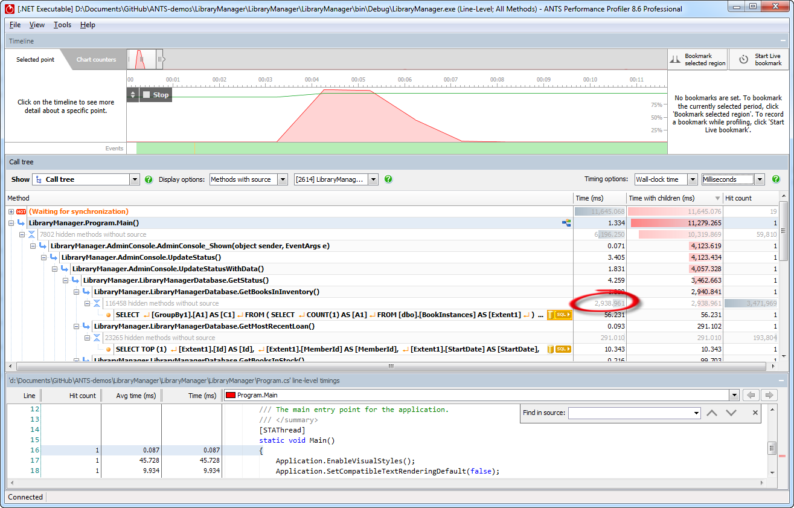

Drilling down into that by selecting to show all methods, we can see that most of that startup time is actually being spent setting up EF. It’s a one-off cost at the start of the app loading, so probably not worth caring about.

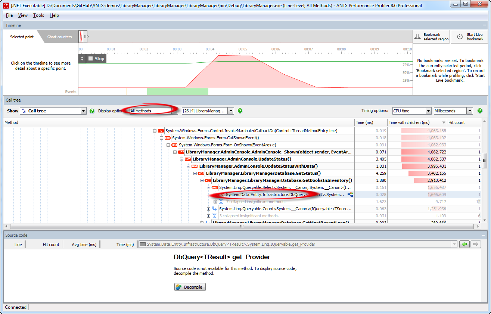

### Slow SQL queries
Change back to showing all methods, and use wall clock time. Run a search for members in London, who have current loans (tick the box). Viewing the call tree for that window of time (this is a good time to illustrate Bookmarking or Live Bookmarking) shows a database query being run 250 times. This isn’t causing a huge performance issue right now, but it’s really wasteful and will ultimately put a lot of unnecessary load on the database server. The actual action of searching is pretty fast right now in development, but is likely to cause scaling problems and upset the DBA. It’s an example of the value of regular exploratory performance testing with ANTS to find problems early.

It’s caused because lazy loading is switched on by default in EF, and to filter the data the app gets a list of people in London, then for each of them checks whether they have loans outstanding, which requires an additional query for each member in London. The solution is to either switch off lazy loading (bad solution because often it has performance benefits), or to write a better search method that can return only members with loans in the first place in a single query (the correct solution).

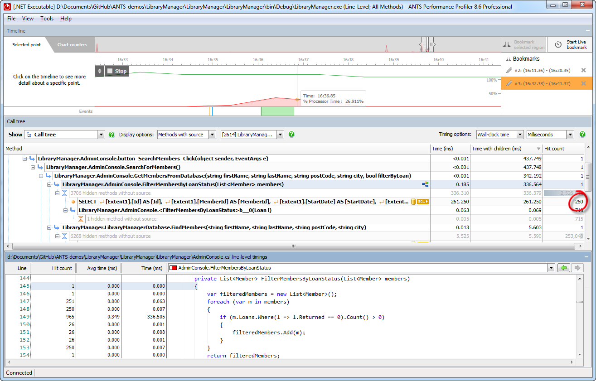

### Slow API calls
Having searched for a member, if you click on their name, it will load details about them into the details pane. This takes quite a long time. Looking at this time window, the time is spent making a web request. The application is loading the member’s details from the database, but the picture is being retrieved from the web API.

Selecting the web request, you can see the header information. One clue in the headers is the suggestion that the original size is `4500x6300`. Possibly the api has stored hi-res photos and is dynamically resizing the images, so it would be much more efficient to pre-generate the smaller sizes which might be needed. To find out for sure, we’d have to go and profile the API layer separately, but for now we’ve identified the aspect of loading member details which is slow.

**Note**: The API layer is actually just doing `Thread.Sleep()` rather than truly resizing the images, as it wasn’t relevant to this demo.

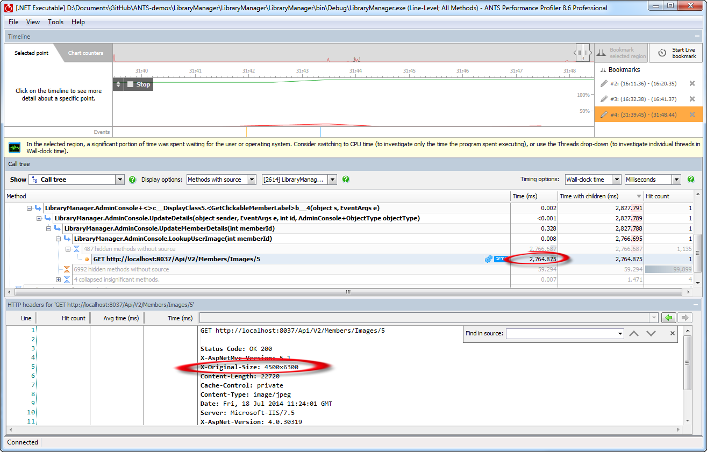

### It takes long time to load the results
If you search for books without the ‘Search in Archive’ button ticked (searching for the word ‘Monster’ without an author name is a good example), it takes a long time to load the results. We might have assumed that this is a problem related to the lazy loading example earlier, but in fact most time seems to be being spent in methods without source.

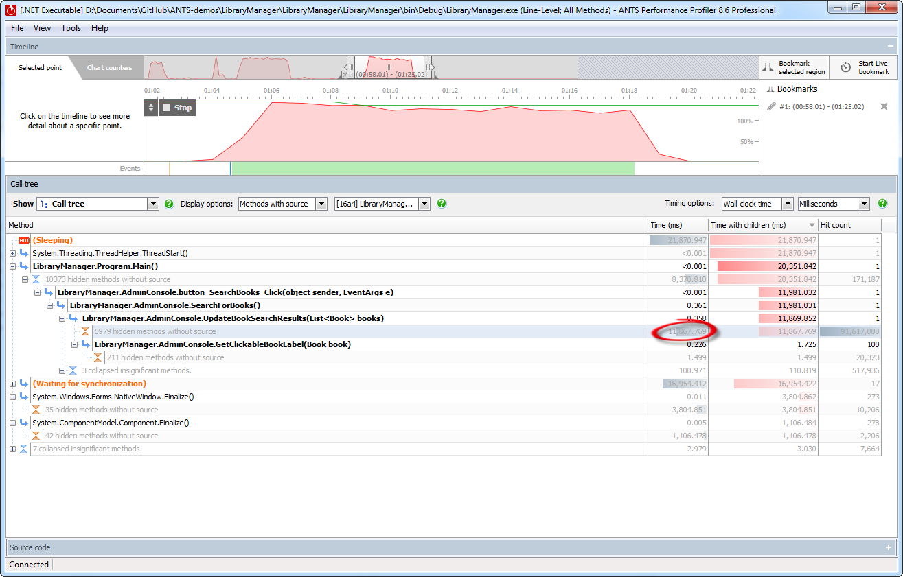

Selecting to view all methods, you can see the time is being spend in `TableLayoutControlCollection.Add()` which is hit 300 times. You can also look at the source for `UpdateBookSearchResults()` which shows line-level timing data, showing that the three lines which add controls to the tableLayoutPanel are hit 100 times each, and take most time.

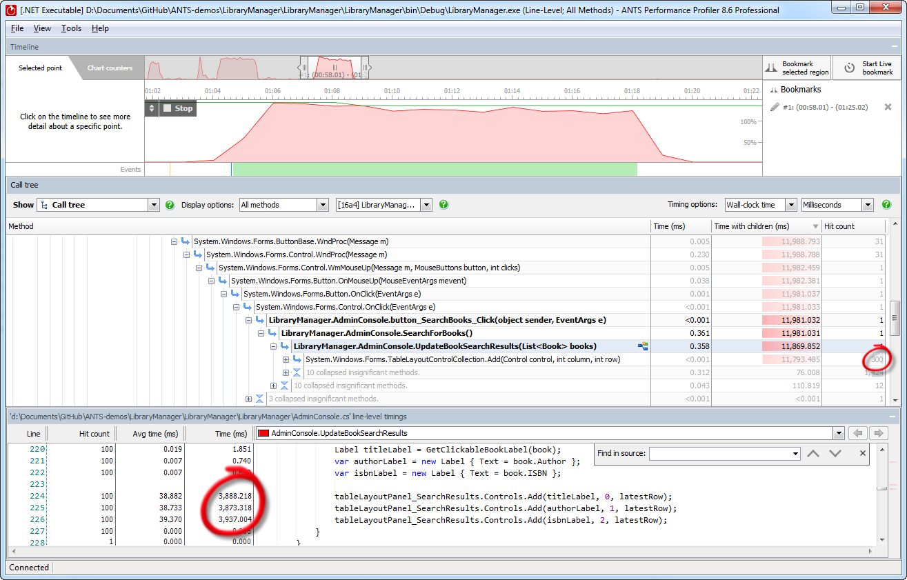

If we drilled down even further into the system code, we’d see that there’s a
lot of low-level layout going on as a result of each control we add.

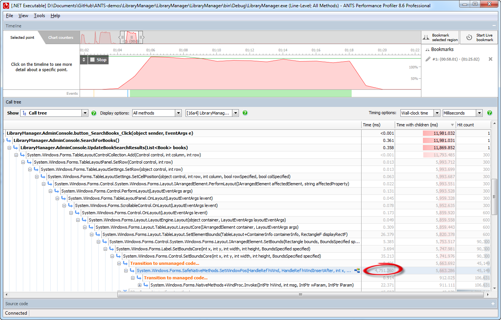

Essentially the problem is that we’re making a lot of updates to how the window should look, and after each one the window is being redrawn, so this is a rendering problem. An easy fix would be to suspend layout for the duration of adding those controls, which makes it a lot faster (though the general approach of adding controls to the tableLayoutPanel to show a list here isn’t very good to start with, so we might want to do something more radical).

It’s possible to use this example to show ANTS’ integrated decompilation too using the .NET Reflector engine, by selecting `TableLayoutControlCollection.Add()`, opening the source window, and hitting Decompile. This doesn’t show anything valuable, but is the best chance to show the feature in this particular app.

This is a good example of ANTS saving time by directing your efforts to the right place. When searching is slow, the natural assumption would be that there is a problem with data access, particularly given the previous EF lazy loading issue, but in fact it was nothing to do with that and we could have wasted time by optimising the wrong area of code.

### Slow archive search
If you search for books in the archive, the search runs slowly. Search with the **‘Archive’** box ticked for either books called *‘Monster’* by **‘John’**, called *‘Zombie’* by **‘Lee’**, or called *‘Storm’* by **‘Howard’**.

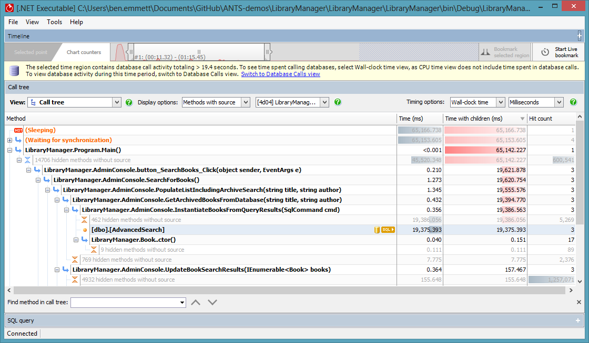

ANTS will show most time as having been spent running a stored procedure called
AdvancedSearch. In previous versions, this would have been a dead end. Now
clicking the Sql button, you get the database view. From here, you can click the
Plan button to fetch the stored procedure’s execution plan.

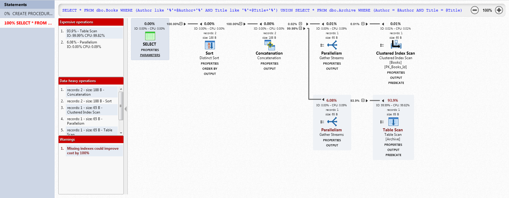

The problem shown is that there is no index on the archive table, so to retrieve data from it SQL Server has to do a table scan, hitting every row of the table. Although the `sproc` does a `LIKE ‘%XYZ%’` match on the Books table and an `=` match on the Archive table, the Archive table has millions of rows vs the few thousand in the **Books** table, so the **Archive** table scan still account for most of the time spent. This is a good chance to show some features of the plan explorer in APP, including picking out expensive and data heavy operations on the left hand side to jump to that node, as well as expanding to explore any properties for those.

You’ll also get an explicit warning about the missing indexes, and clicking it will pop up a creation script. It might be worth talking about the performance trade-offs of indexes.

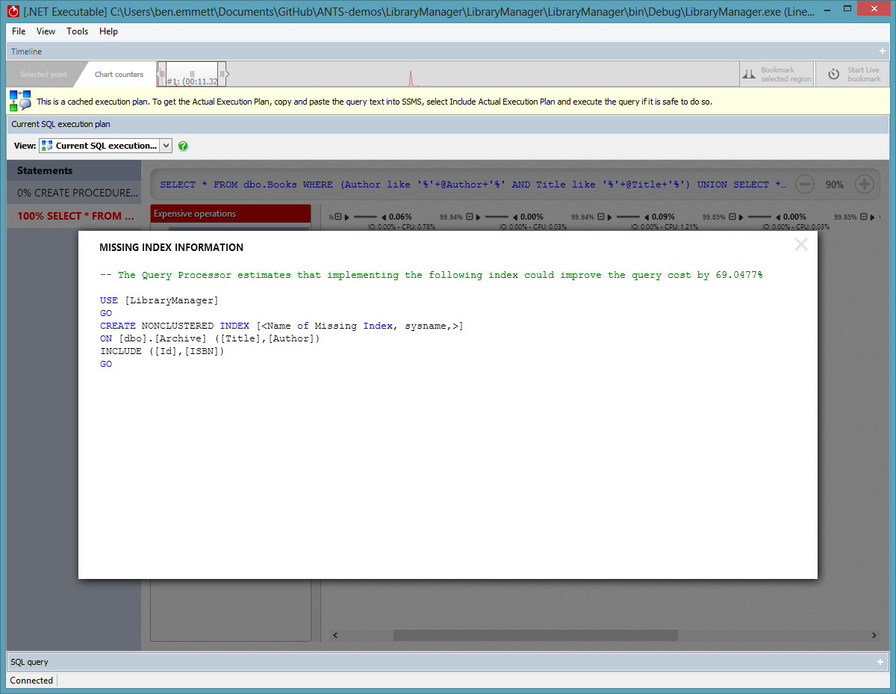

Going back to the **Database View**, you can also show the additional data collected about SQL Server queries / stored procedures. Drilling down into a procedure, you’ll see parameter values and the time taken for each run (in this example they’re comparable, but in other scenarios parameter values can drastically affect execution time).

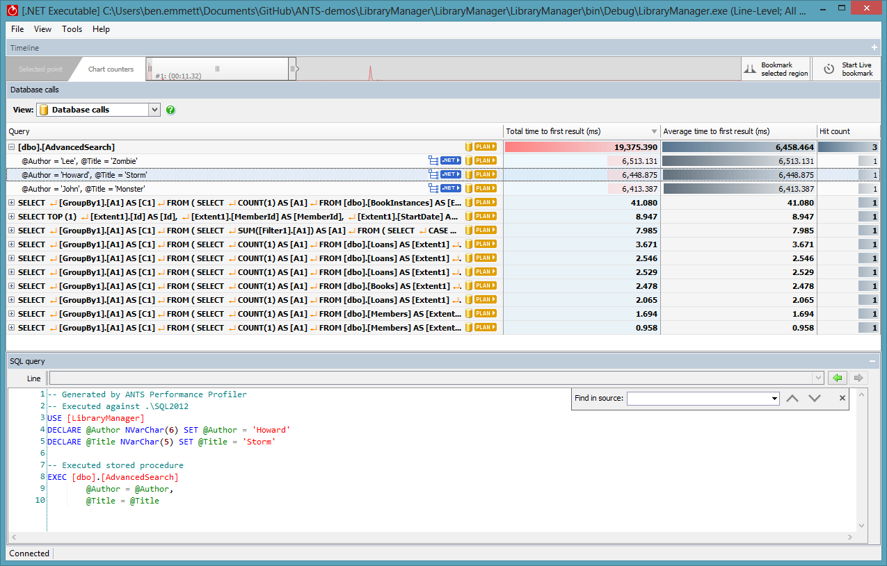

After clicking on any one, the source code window shows a script that can be copied + pasted in to SSMS to use the correct database, declare the values of parameters and then run the query, so it can be debugged in another environment or passed to a colleague easily.

### Slow magazines search
If you search for magazines by Bill Finger (leave the title blank, and untick search archive), searching is slow. We can see in the call tree that all the time is spent running a query.

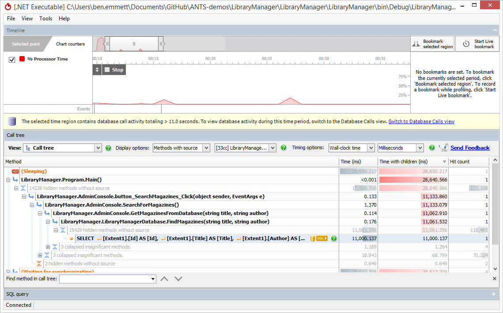

If we look at the query plan, we see a type conversion warning, implicitly converting the Title column to nvarchar. We can also see in the plan that an **index scan** is used

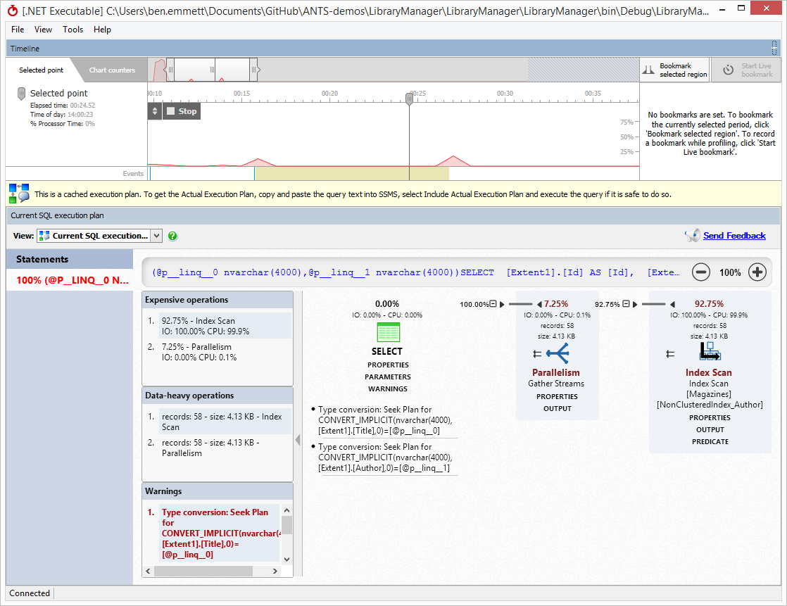

If we flick back to the database calls view we can see what’s going on. The `@p__linq__0` parameter is submitted with type `NVarChar`, while the **Title** column is of type `VarChar`. Because SQL Server can’t implicitly convert `NVarChar` to `VarChar`, it has to convert the entire `VarChar` **Title** column to `NVarChar` to do the comparison, resulting in a full index scan.

Entity Framework will submit strings as `NVarChar` by default, because strings in .NET are represented as Unicode. By modifying the EF model to include `[Column(TypeName = "varchar")]` we can instruct Entity Framework to use `VarChar` instead, which will allow SQL Server to use a dramatically more efficient index seek operation.

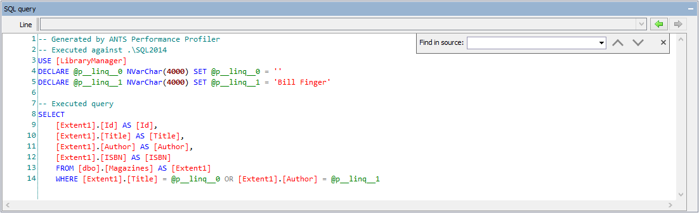

## Other notes

This document is meant to describe where the performance problems are. Some of these problems are best observed using **wall clock time** shown in **milliseconds**.

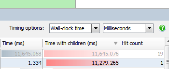
