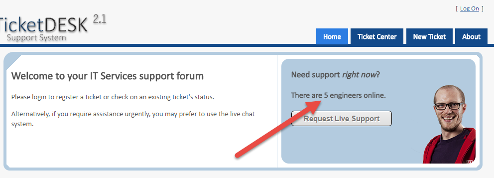
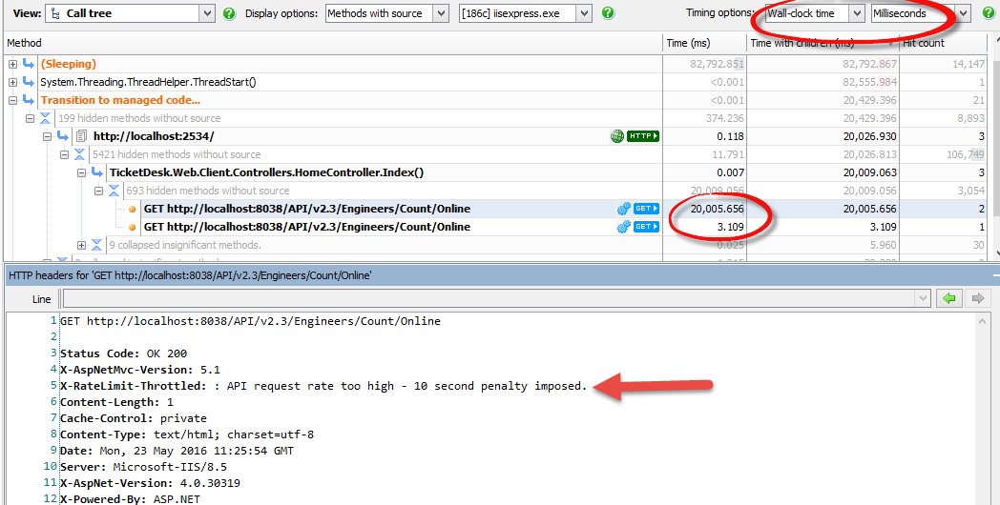
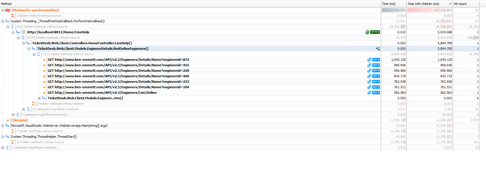
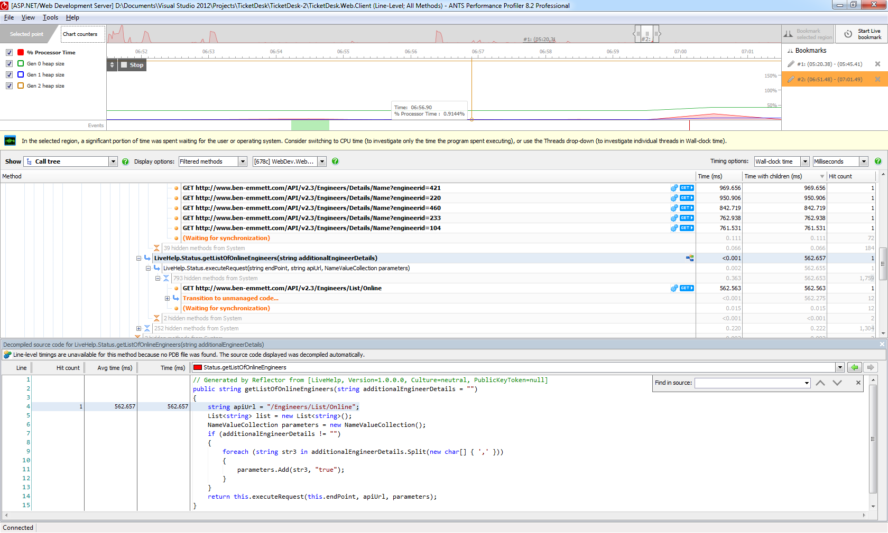
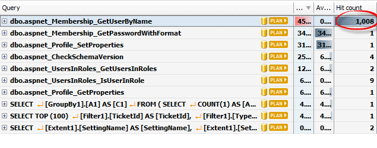
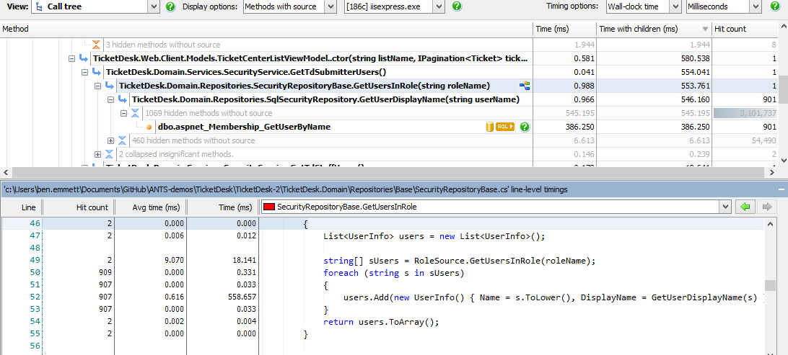
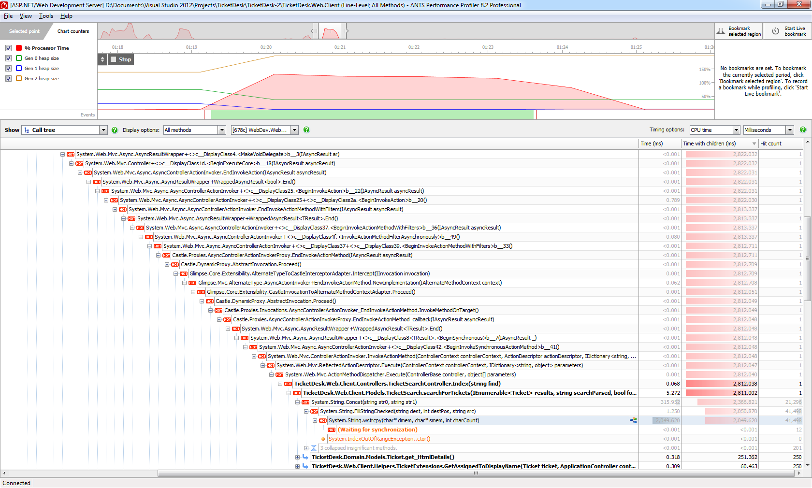
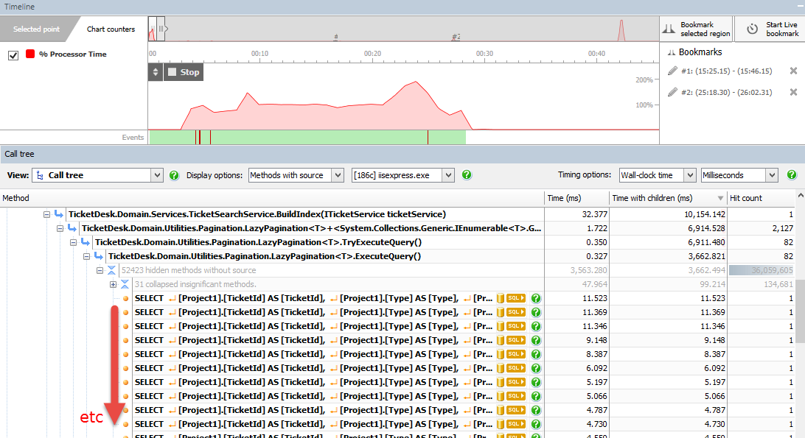

# TicketDesk

This isn’t an exhaustive list of everything TicketDesk can show, but does show some of the more useful things to demonstrate with APP. It doesn’t list any of the things you can show in Glimpse / AMP / Chrome dev tools.

Note that this is based on the [TicketDesk](https://ticketdesk.codeplex.com/) open source project, which is released under the Microsoft Public License. Most of these performance issues did not exist in the original project!

## Setup

1) Create a new database called **TicketDesk** and restore to it from `.\Database\TicketDesk.bak`

2) Create a new site in IIS pointing to `.\FakeApi\Mvc\FakeApi`.

3) Modify the 3 connection strings in `TicketDesk.Web.Client/web.config` to point to your database.

4) Also in `web.config`, modify the `ApiBaseUrl` key to point to the place you set up the api in Step 2.

5) Open `.\TicketDesk-2\TicketDesk2.sln` and rebuild, so the PDBs point to the correct location on your machine.

6) Profile `.\TicketDesk-2\TicketDesk.Web.Client`

## Performance problems

### Slow web requests

Every time you load the homepage it calls out to that API to find out how many engineers are online. Page load is normally fast, but if you mash F5 4-5 times, it will load very slowly.

Looking in ANTS, you see web requests being made out to the API. Some are very fast (a few ms), some are much much slower. Choose one of the fast requests to look at the headers. All looks good. Then switch to looking at one of the slow ones. Notice the slow requests have an extra header added saying the rate limit is throttled. Basically we’re hitting the api too hard so it’s slowing us down. Options: if we own the api, take out the rate limiting. Alternatively cache the result for a few seconds.

### Unnecessary web requests due to poos api usage

If you go to the **live help** page, you find it uses the **LiveHelp** project (which deliberately doesn’t generate PDBs so we don’t see its source code) to get information about online engineers from an API. In `FindOnlineEngineers()` the application first queries the API for the IDs of engineers who are online, then for each of them it looks up their name by their ID, resulting in multiple web service calls.

First, observe that those requests to get each of the engineers’ details could be parallelised which would be faster.

Show all methods (and optionally then filter out everything in `System.`) to see everything in the `LiveHelp` namespace.

Using integrated decompilation you can see a more efficient use of the API was possible; decompile `LiveHelp.Status.getListOfOnlineEngineers()` to see that we could have passed in a list of additional details to fetch in a single request.

### Many sql requests

Click **Ticket Centre**, and log in with un=`aaron`, password=`password`. In the db view, notice `GetUserByName` is hit around a thousand times. Expand it to see all the parameter values, then hit one of their .NET buttons to see where in the call tree that was run.

The query’s run each time `GetUserDisplayName` is hit, and that’s being run in a loop by `GetUsersInRole()` to fill in missing data. Obviously all the desired data should have been fetched in one go. The total cost isn’t massive, but it’s still unnecessarily expensive - discovering this kind of problem early is one of the benefits of looking at performance proactively - it helps avoid the risk of performance suddenly deteriorating if you unexpectedly experience eg latency between the **web server <\> db**.

### String concatenation

If you run a search for `imported` then 250 results get returned, but it takes a long time. The initial assumption might be slow querying, but it turns out to be a problem with **string concatenation** when rendering the search results - giant html is being constructed in `SearchForTickets()`.

### Slow startup because of lots of sql

On startup, a ton of queries are run. They could be grabbed in one go, or handled differently.

